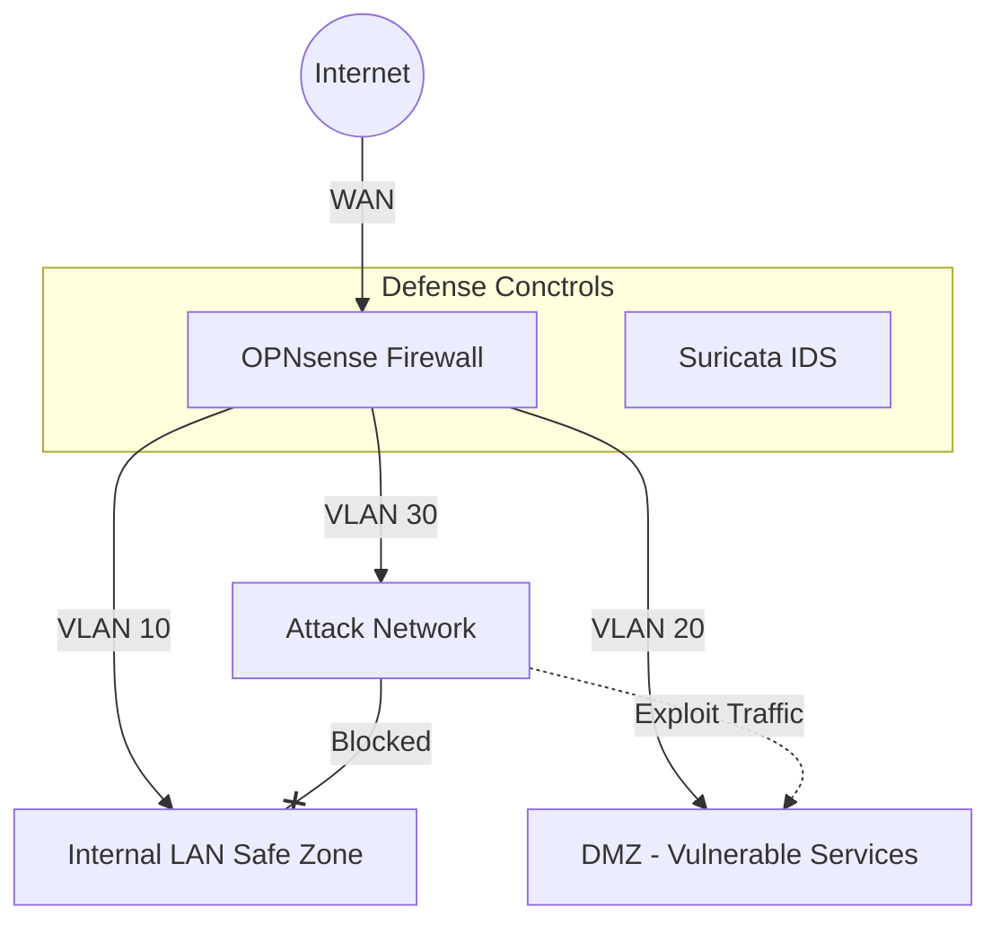
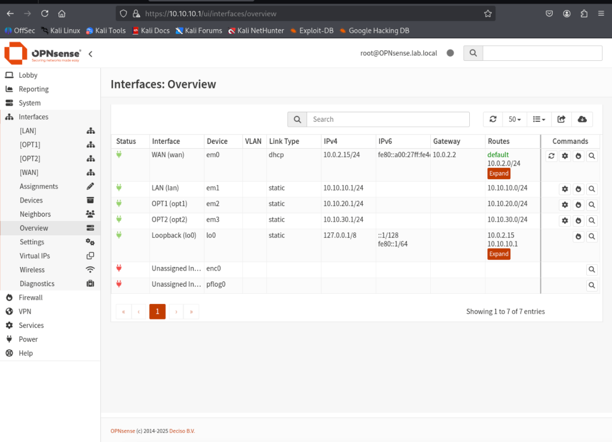
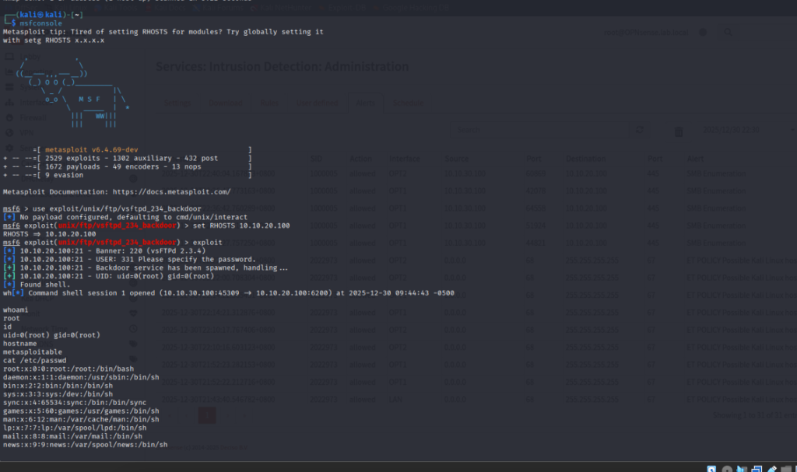
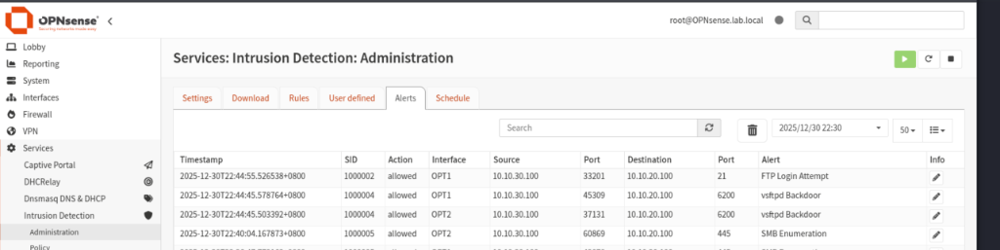

# 🛡️ CyberFortress Lab: Network Attack & Defense Simulation

A comprehensive home lab simulating a real-world enterprise network environment to practice **Network Security Monitoring (NSM)**, **Intrusion Detection**, and **Penetration Testing**.

> **Project Goal**: Design a segmented network, deploy a firewall and IDS, simulate realistic cyber attacks, and analyze the resulting traffic logs to create actionable intelligence.

---

## 📖 Table of Contents
1. [Introduction](#-introduction)
2. [Network Topology](#️-network-topology)
3. [Prerequisites & Tools](#-prerequisites--tools)
4. [Step 1: Environment & Firewall Setup](#-step-1-environment--firewall-setup)
5. [Step 2: IDS Configuration (Suricata)](#-step-2-ids-configuration-suricata)
6. [Step 3: Attack Simulation Phase](#-step-3-attack-simulation-phase)
7. [Step 4: Monitoring & Incident Response](#-step-4-monitoring--incident-response)
8. [Conclusion & Key Takeaways](#-conclusion--key-takeaways)

---

## 📌 Introduction
This project goes beyond simple VM connectivity. It establishes a **Zero Trust-inspired** network architecture with strict segmentation between zones (LAN, DMZ, Attack). The primary focus is observing how defensive tools (OPNsense, Suricata) react to standardized adversarial techniques (like those in the MITRE ATT&CK framework).

**Core Capabilities Demonstrated:**
*   Firewall Rule Management & Network Segmentation
*   Signature-based Intrusion Detection (Suricata Custom Rules)
*   Malware & Exploit Traffic Analysis
*   Log Aggregation & Forensic Review

---

## 🏗️ Network Topology
The lab simulates a corporate network exposed to an external threat environment.



**Zones:**
*   **Attack Zone (10.10.30.0/24)**: Houses Kali Linux (The Adversary).
*   **DMZ (10.10.20.0/24)**: Houses Metasploitable (The Target) running vulnerable services (FTP, HTTP, SMB).
*   **LAN (10.10.10.0/24)**: Secure internal network; protected from the Attack zone.

---

## 🛠 Prerequisites & Tools
To replicate this lab, the following tools were deployed:

*   **Virtualization**: VirtualBox / VMware Workstation
*   **Firewall**: [OPNsense 25.7](https://opnsense.org/)
*   **IDS Engine**: Suricata (Embedded in OPNsense/Security Onion)
*   **Attacker**: Kali Linux 
*   **Victim**: Metasploitable 2 / Windows 10

---

## 🚀 Step 1: Environment & Firewall Setup
The first defense layer is **Network Segmentation**. Using OPNsense, I configured interfaces and firewall rules to strictly control traffic flow.

### Firewall Policy
*   **ALLOW**: Attack Network -> DMZ (To simulate exposure)
*   **BLOCK**: Attack Network -> LAN (To protect internal assets)
*   **LOG**: All blocked traffic for auditing


*Figure 1: Interface assignment in OPNsense ensuring physical/logical separation.*


---

## ⚙️ Step 2: IDS Configuration (Suricata)
I deployed Suricata to inspect traffic moving into the DMZ. Default rulesets (ET Open) were enabled, but I also authored **custom signatures** to detect specific behaviors of my simulated attacks.

### Custom Rules (`configs/suricata/custom.rules`)
```bash
# Detect vsftpd Backdoor Command Execution
alert tcp any any -> $HOME_NET 6200 (msg:"vsftpd Backdoor"; sid:1000004;)

# Detect Suspicious FTP Login Failures
alert tcp any any -> $HOME_NET 21 (msg:"FTP Login Attempt"; sid:1000002;)

# Detect SMB Scanning
alert tcp any any -> $HOME_NET 445 (msg:"SMB Enumeration"; sid:1000005;)
```

---

## ⚔️ Step 3: Attack Simulation Phase
Using **Metasploit Framework**, I executed a controlled attack chain against the DMZ assets.

### Exploitation Workflow
1.  **Reconnaissance**: `nmap -sV 10.10.20.5` identified open ports.
2.  **Exploitation**: Used `exploit/unix/ftp/vsftpd_234_backdoor`.
3.  **Post-Exploitation**: Verified root access.


*Figure 2: Metasploit console showing successful root shell acquisition.*

> 📕 **Attack Guide**: Full attack logs and methodology are documented in [Attack Guide](docs/ATTACK_GUIDE.md).

---

## 🔍 Step 4: Monitoring & Incident Response
Immediately after the attack, I verified the detection capabilities of the SOC stack.

### Verification 1: Firewall ACLs
I confirmed that the Attack machine **could not** move laterally to the secure LAN.


### Verification 2: IDS Alerts
Suricata successfully flagged the backdoor traffic based on the signature logic defined in Step 2.


---

## 🎯 Conclusion & Key Takeaways

This project successfully demonstrated the importance of **Defense-in-Depth**.
1.  **Segmentation works**: Even if the DMZ was compromised, the LAN remained untouched.
2.  **Signatures are critical**: The custom Suricata rule fired exactly when the specific payload was sent, validating the need for tailored detection logic.
3.  **Visibility is king**: Without logs from OPNsense and Suricata, the exploitation would have been silent.

### Future Improvements
*   [ ] Integrate Splunk for centralized log ingestion.
*   [ ] Deploy a Windows Domain Controller to practice Active Directory attacks.
*   [ ] Automate rule updates with Oinkmaster.

---

### 📂 Repository Structure
```
├── configs/
│   └── suricata/custom.rules   # Custom detection signatures
├── docs/                       # Detailed setup & attack logs
├── analysis/                   # IOCs and PCAP analysis
└── screenshots/                # Proof of Concept images
```
